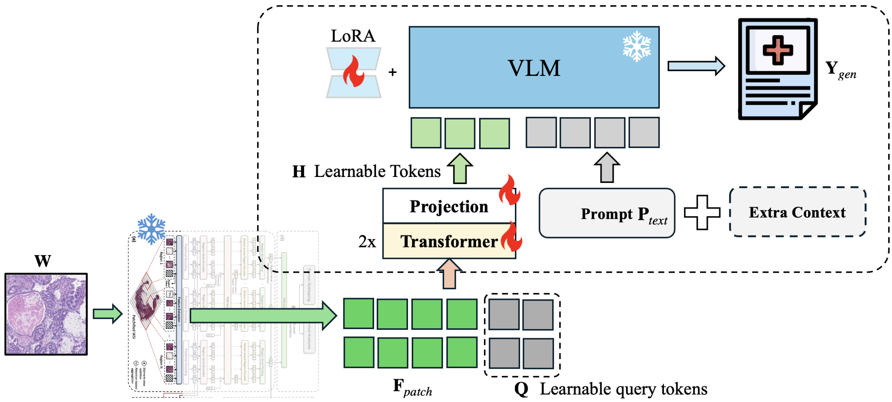
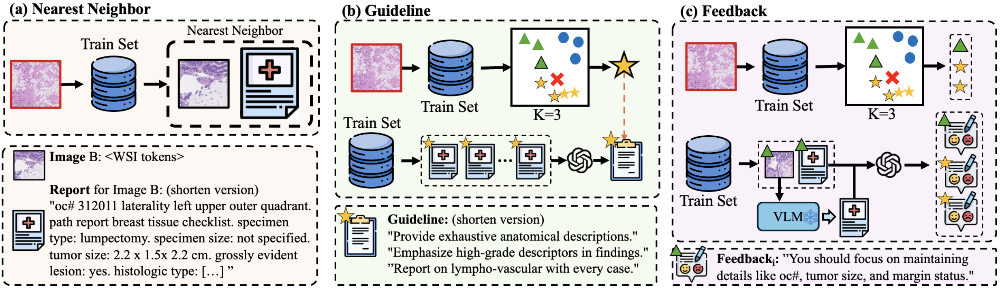

# 🏥 PathGenIC: Histopathology Image Report Generation by Vision Language Model with Multimodal In-Context Learning
- **Authors**: Shih-Wen Liu, Hsuan-Yu Fan, Wei-Ta Chu, Fu-En Yang, Yu-Chiang Frank Wang  
- **Conference**: MIDL 2025 (Under Review)  
- **[Paper Link - TBD]**()  

This repository provides the official implementation of **PathGenIC**, a multimodal in-context learning framework for generating medical reports from histopathology images. Our approach enhances traditional vision-language models through three key strategies:  

- **Nearest Neighbor**: Dynamically retrieves similar cases for context.  
- **Guideline**: Follows structured diagnostic rules for consistency.  
- **Feedback**: Learns from mistakes to refine report generation.  

These strategies work together to improve contextual relevance and report quality. 🚀

## ✨ Key Features  
- **Multimodal In-Context Learning (ICL)**: Uses retrieved whole slide image (WSI)-report pairs to enhance report generation.  
- **Fine-Tuned Vision-Language Model (VLM)**: Adapts Quilt-LLaVA with domain-specific enhancements.  
- **State-of-the-Art Performance**: Achieves top results on the **HistGen** benchmark, improving BLEU, METEOR, and ROUGE-L scores.  
- **Pretrained Model Available**: Download the model weights from **[Hugging Face](https://huggingface.co/Casper666/PathGenIC)**.  

## 🧠 Model Overview  

### **Base Model Structure**  
  


### **PathGenIC Methodology**  
  


## 🏗️ Repository Structure  
```
📂 PathGenIC
├── 📂 models       # Model architectures & fine-tuning scripts
├── 📂 data         # Scripts for preprocessing HistGen dataset
├── 📂 experiments  # Training & evaluation scripts
├── train.py        # Main training script
├── inference.py    # Report generation pipeline
└── README.md       # This file
```  

## 🚀 Quick Start  
1. Clone the repository:  
   ```bash
   git clone https://github.com/casperliuliuliu/PathGenIC.git
   cd PathGenIC
   ```
2. Install dependencies:  
   ```bash
   pip install -r requirements.txt
   ```
3. Download the pretrained model from Hugging Face:  
   ```bash
   git lfs install
   git clone https://huggingface.co/Casper666/PathGenIC
   ```
4. Run inference on a test WSI:  
   ```bash
   python inference.py --wsi path/to/wsi --model_path Casper666/PathGenIC
   ```  

## 📊 Results  
PathGenIC achieves **state-of-the-art** performance on the **HistGen benchmark**, outperforming existing methods in BLEU, METEOR, and ROUGE-L metrics.  

| Model | BLEU-4 | METEOR | ROUGE-L | FactENT | BERTScore
|--------|--------|--------|--------|--------|--------|  
| HistGen (Previous SOTA) | 0.184 | 0.182 | 0.344 | - | - |
| Base Model (Ours) | 0.178 | 0.184 | 0.336 | 0.445 | 0.633 |
| **PathGenIC (Ours)** | **0.196** | **0.197** | **0.357** | **0.462** | **0.641** |

## 📌 Citation  
If you find this work useful, please consider citing:  
```
@article{Liu2025PathGenIC,
  title={Histopathology Image Report Generation by Vision Language Model with Multimodal In-Context Learning},
  author={Shih-Wen Liu and Hsuan-Yu Fan and Wei-Ta Chu and Fu-En Yang and Yu-Chiang Frank Wang},
  year={2025}
}
```  

## 📝 License  
This project is released under the **CC-BY 4.0** License.  